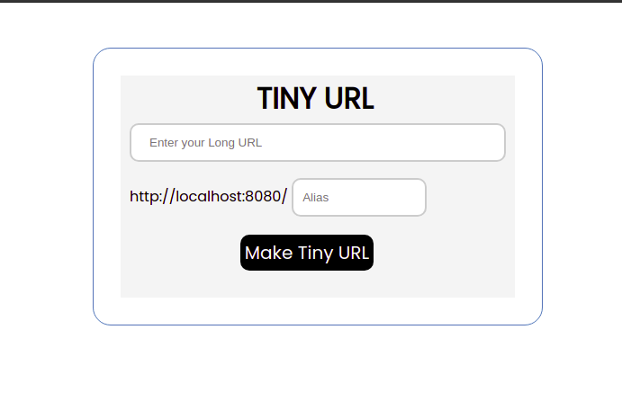
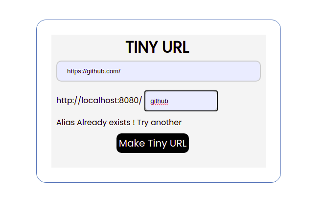
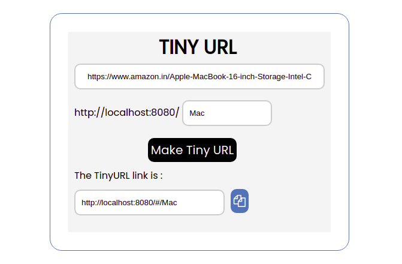

# Tiny-URL
It is a URL shortening web service , which provides short aliases for long URLs.  


<p align="center">
  <a href="https://github.com/Nikhilnama18/Tiny-URL">
    
  </a>
</p>

## :bookmark_tabs: What's In This Document
- [Introduction](#Introduction)
- [Get Up and Running in 5 Minutes](#rocket-get-up-and-running-in-5-minutes)
- [How To Shorten The URL](#How-To-Shorten-The-URL)
- [How To Visit The Long URL With Alias](#How-To-Visit-The-Long-URL-With-Alias)
- [How It Works](#How-It-Works)
- [FAQs](#FAQs)

## Introduction
Tiny URL addresses the problem where the URLs are too long to remember.

So , instead of bookmarking or storing them some where , Tiny-URL can be used to short those URLs with an **alias you want**.

Tiny-URL shortens the long URL and let's you access it with just the easy to remember **alias**.

## :rocket: Get Up and Running in 5 Minutes
You can get the Tiny URL up and running in your local machine with in 5 minutes by doing the following steps.

The following steps consider Node.js is available in the machine. If not you can get it from [here](https://nodejs.org/en/).

**Clone the repository**

Open the terminal and paste the following command to clone.

```shell
git clone https://github.com/Nikhilnama18/Tiny-URL.git
```

**Install dependencies and Vue.js**

Navigate to the root directory of the project.

```shell
cd Tiny-URL/back-end/
```
Create your MongoDB Database and paste your MongoDB connection string in ``` backend/app.js``` at line number 27 

Then install dependencies and run the back-end server which will be lisiting on port number 3000 

``` shell 
npm install
npm run start
```
Get back to the root directory and open front-end and run the front-end service 

``` shell
cd ../front-end/vue-ui
npm install vue
npm intall
npm run serve
```

That's it , click [here](http://localhost:8080) to open the application.


## How To Shorten The URL 
Open the Tiny-URL application running at ```http://localhost:8080```

Paste the Long URL in the given 1st field and name the URL with an Alias in the 2nd field and click **Make Tiny URL**.

It is as simple as that . Now the long URL is shortened.

<p align="center">
  <a href="https://github.com/Nikhilnama18/Tiny-URL">
    
  </a>
</p>

<p align="center">
  <a href="https://github.com/Nikhilnama18/Tiny-URL">
    
  </a>
</p>
## How To Visit The Long URL With Alias 

Type the alias after our application hostname which is ```http://localhost:8080```.

```
http://localhost:8080/#/${your-alias}
```

You will be redirected to the URL the alias is pointing to.

## How It Works
We store your URL and Alias in a database.

When ever you give your alias after our web host address, we retrive the data(URL) based on your alias and redirect you to the corresponding page.

## FAQs

Q . What if i try add another url to use existing alias ?

A . No, since the alias is already used, you need to give another alias.
